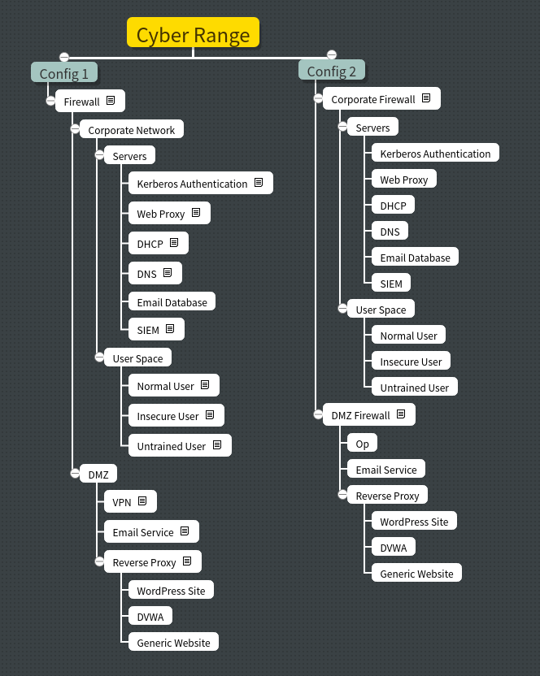

# -----------Discontinued-----------

This project has been discontinued. I've recently found out about the GNS3 project, which by and large does everything I'd aimed to do with this project. I've leared a lot doing this project and I'm happy with how far it got even if it's nowhere near complete.

# Athena
The aim of this project is to allow people to configure and use a cyber range without having to go through the painstaking process of building a virtual network from scratch. In the initial stages I'll be creating a basic docker network, then I'll work on auto configuring some virtual machines, and finally move to make a front-end for the project.

The project is based on the work I did on my final year project at university. This was developed for the same purpose, however, given the virtual machines I was using it would not have been feasible to run the system as a cyber range as it wouldn't have been able to handle much network traffic and the machines would not have been resilient to any form of attack. This project was published in a journal article. For more information please see the article, which is available [here](https://www.mdpi.com/2224-2708/6/3/16).

The idea is that this will be useful to form the skeleton of a cyber range, more specific requirements will require further tinkering but this should give users a head start when creating a range. I've named the project after the Greek Goddess of warfare, more specifically strategic warfare as the aim of this tool is to assist in training teams to deal with cyber attacks; I also figured it would be nice to give it a name rather than referring to it with a long winded name.

This is currently a work in progress and will therefore take some time to build and the project will change over time.

